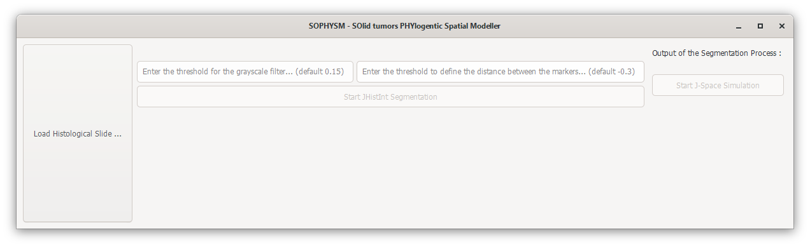
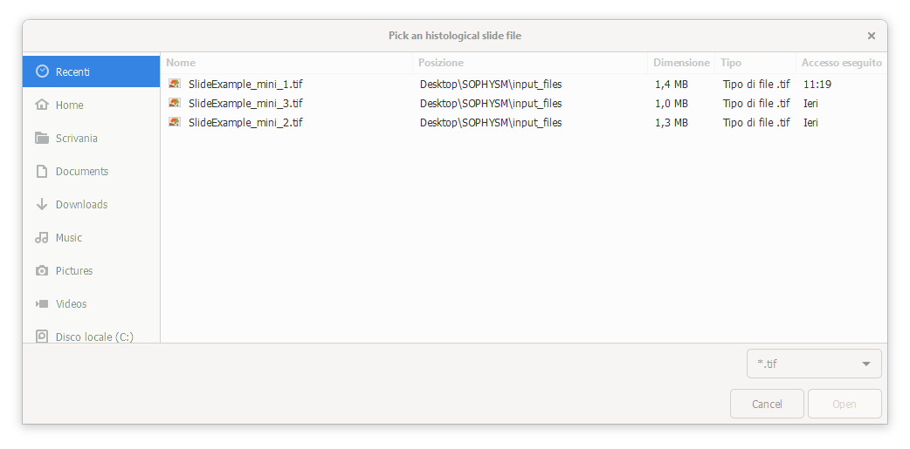
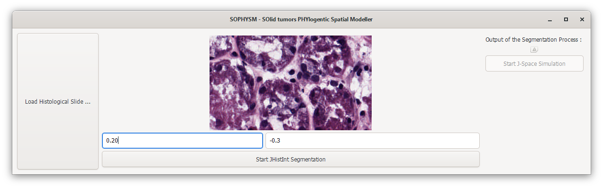
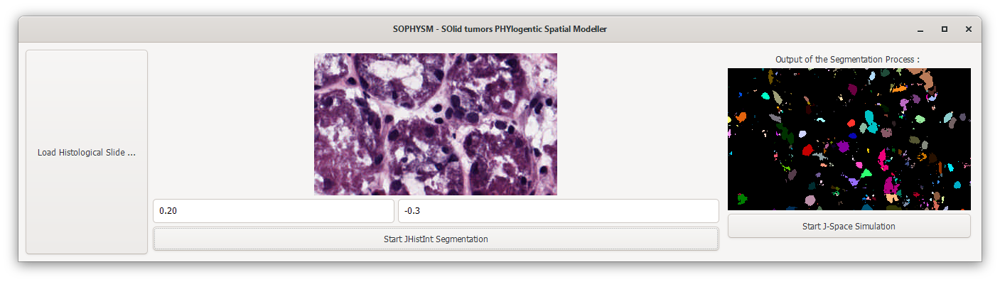
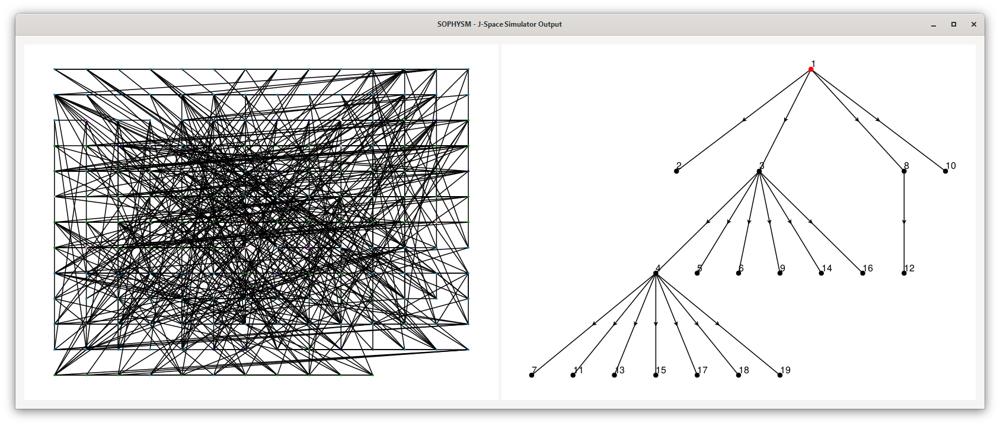

# SOPHYSM - SOlid tumors PHYlogentic Spatial Modeller
SOPHYSM is a software for spatial phylogenetic modeling of solid tumors. It integrates image-processing functionalities for the segmentation of histological slides, allowing the extraction of spatial and morphological information from microscopic images, thereby providing a better understanding of tumor architecture and cellular interactions in space. The analysis derived from the slides provides valuable input for spatial and phylogenetic simulations. Firstly, the software simulates the spatial dynamics of the cells as a continuous-time multi-type birth-death stochastic process on a graph employing different rules of interaction and an optimized Gillespie algorithm. After mimicking a spatial sampling of the tumor cells, SOPHYSM returns the phylogenetic tree of the sample and simulates the molecular evolution of the genome under the infinite-site models or a set of different substitution models. There is also the possibility to include indels. Finally, employing `ART`, SOPHYSM generates the synthetic single-end, paired-/mate-pair end reads of the next-generation sequencing platforms.  

## Resources
- The image-processing pipeline and segmentation algorithm is provided by the Julia package `JHistint` available at the following GitHub repository : [JHistint Repository](https://github.com/niccolo99mandelli/JHistint.jl.git).  
- The simulation of the spatial growth and the genomic evolution of the cell population and the experiment of sequencing the genome of the sampled cells is provided by the Julia package `J-Space` available at the following GitHub repository : [J-Space Repository](https://github.com/niccolo99mandelli/J-Space.jl.git).  

## Usage
The software provides a user interface where users can upload the histological slide to be segmented in formats such as `.png`, `.jpg`, `.tif`. The image will be displayed on the screen, and before initiating the segmentation process, users can assign values for the grayscale threshold and the marker distance threshold. For further information consults: [Julia Images Documentation - Watershed algorithm](https://juliaimages.org/v0.21/imagesegmentation/).  
The segmentation result will be displayed next to the uploaded image, allowing the opportunity to re-segment the image if the result is unsatisfactory. Upon completion of the segmentation process, users can proceed with the simulation using the `J-Space` module. The simulation results will be displayed in a separate window, and the Julia REPL terminal will provide tracking of the simulation stages. The remaining results from the simulation will be saved in the `output_files` directory within the generated directory for the uploaded image.

<table align="center">
    <tr>
      <td>
        
         
        Starting SOPHYSM
      </td>
    </tr>
    <tr>
      <td>
        
         
        Loading Histological Slide
      </td>
    </tr>
    <tr>
      <td>
        
         
        Definition of Parameters for Segmentation
      </td>
    </tr>
    <tr>
      <td>
        
         
        Segmentation Result
      </td>
    </tr>
    <tr>
      <td>
        
         
        Simulation Result
      </td>
    </tr>
 </table>

