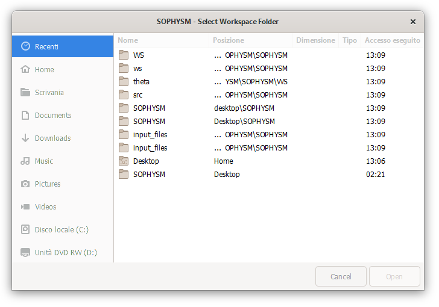
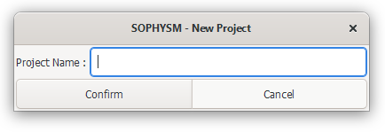
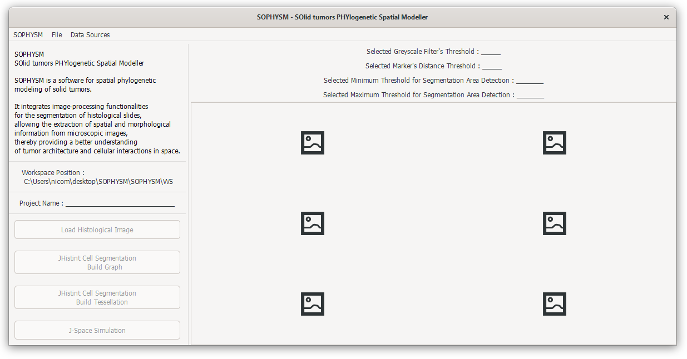
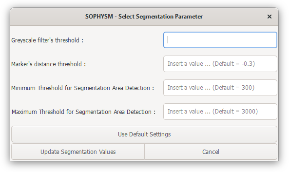
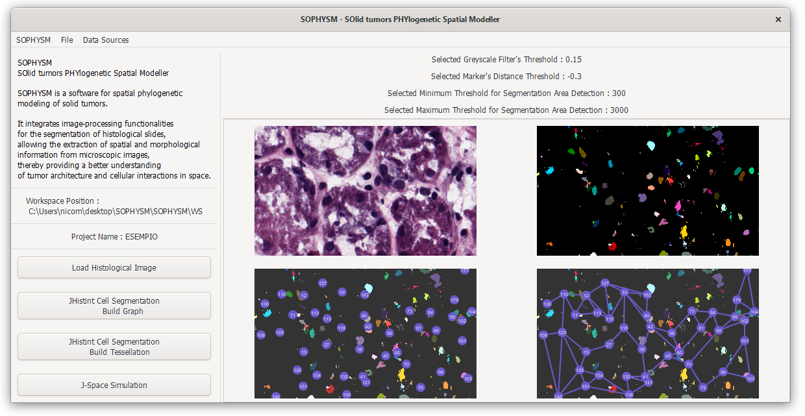
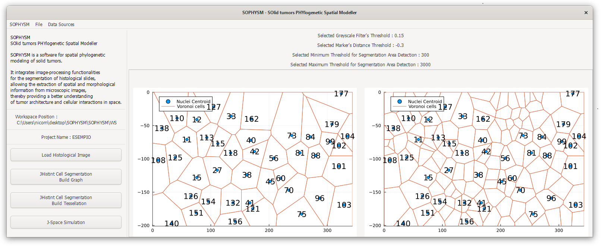
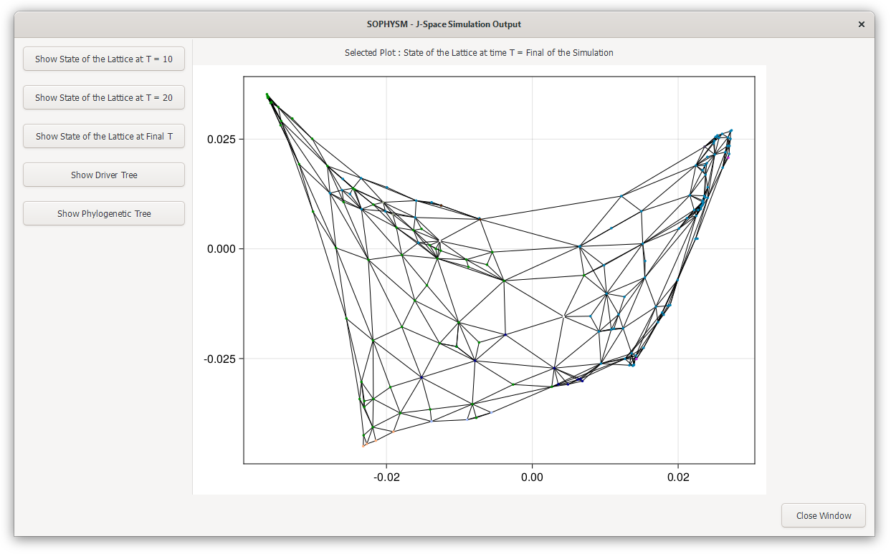
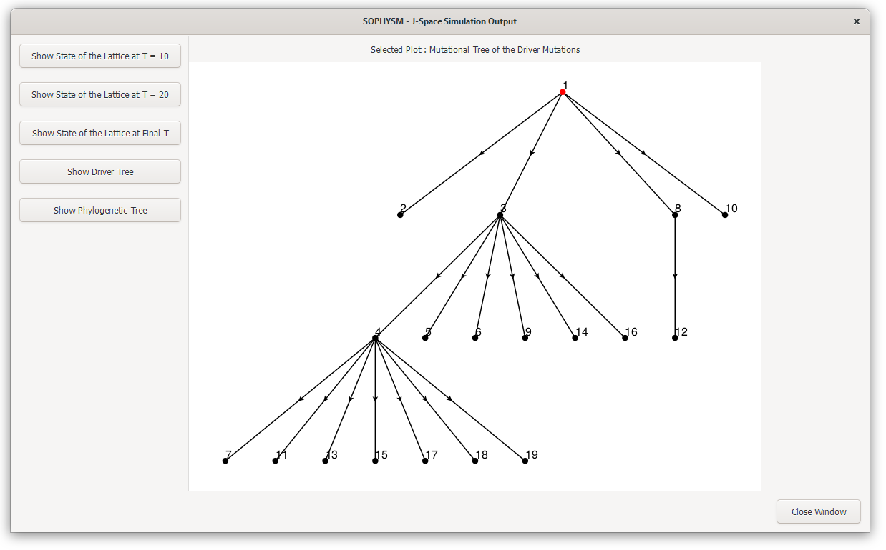
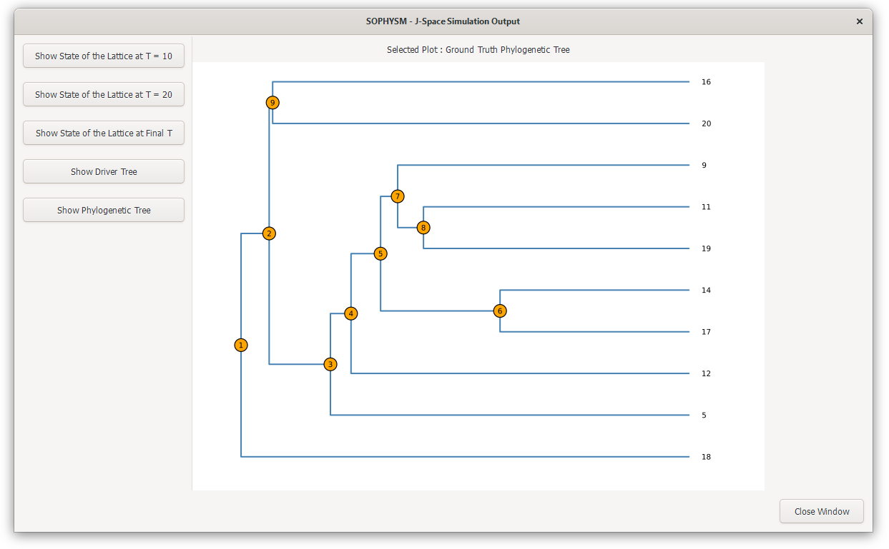
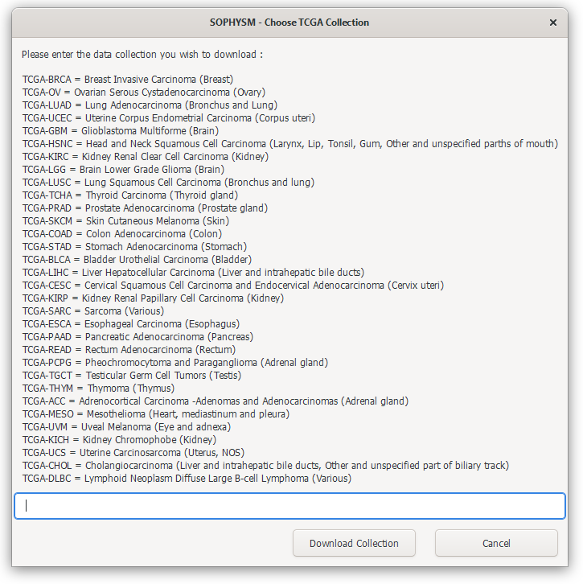

# SOPHYSM - SOlid tumors PHYlogentic Spatial Modeller

SOPHYSM is a software for spatial phylogenetic modeling of solid tumors. It integrates image-processing functionalities for the segmentation of histological slides, allowing the extraction of spatial and morphological information from microscopic images, thereby providing a better understanding of tumor architecture and cellular interactions in space. The analysis derived from the slides provides valuable input for spatial and phylogenetic simulations. Firstly, the software simulates the spatial dynamics of the cells as a continuous-time multi-type birth-death stochastic process on a graph employing different rules of interaction and an optimized Gillespie algorithm. After mimicking a spatial sampling of the tumor cells, SOPHYSM returns the phylogenetic tree of the sample and simulates the molecular evolution of the genome under the infinite-site models or a set of different substitution models. There is also the possibility to include indels.

## Resources

- The image-processing pipeline and segmentation algorithm is provided by the Julia package `JHistint.jl` available at the following GitHub repository: [JHistint Repository](https://github.com/niccolo99mandelli/JHistint.jl.git).
- The simulation of the spatial growth and the genomic evolution of the cell population and the experiment of sequencing the genome of the sampled cells is provided by the Julia package `J-Space.jl` available at the following GitHub repository at the `spatial-input` branch: [J-Space Repository](https://github.com/BIMIB-DISCo/J-Space.jl).

## Usage

The software provides a graphical user interface (GUI) in Julia is designed to facilitate the management of projects related to histological analysis and spatial cancer simulation. It offers a comprehensive set of features to streamline the handling of workspace and dedicated projects that store information and results associated with various case studies. The GUI provides a user-friendly interface to build workspace where you can create and manage projects, each dedicated to a specific case study. Projects serve as containers for storing data and results related to histological analysis and cancer spatial simulation.
The interface provides functionalities to upload histological slides to be segmented. Users can define configuration parameters for histological analysis, allowing for tailored and precise image processing. Image segmentation is a core feature, enabling users to extract meaningful regions of interest from uploaded images as cell or nuclei. For further information consults: [Julia Images Documentation - Watershed algorithm](https://juliaimages.org/v0.21/imagesegmentation/).

In order to optimize the output of the segmentation, users can define a set of configuration parameters:

- `Grayscale-threshold`: Used to define the cutoff threshold for regions determined by the watershed algorithm.
- `Marker-Distance threshold`: Used to determine the maximum distance for generating markers related to nuclei or cells.
- `Minimum-noise threshold`: Used to establish the minimum threshold at which all areas with a surface area smaller than the threshold are eliminated and not considered for defining nuclei or cells.
- `Maximum-noise threshold`: Used to define the maximum threshold at which all areas with a surface area larger than the threshold are associated with nuclei or cells.

Image segmentation can be performed in two modes:

- `Graph-Based Segmentation`: This mode involves constructing an adjacency graph and its corresponding matrix using the powerful `JuliaImages` package (`imagesegmentation.jl`). This approach helps identify interconnections within the cell or nuclei.
- `Tessellation-Based Segmentation`: Users can create tessellations, optimizing spatial input according to the simulator's requirements, effectively partitioning the image for further analysis connected to spatial dynamics.

Once segmentation is complete, the simulation can be initiated to study the spatial distribution of cancerous elements. The results of the simulation are visualized, and users can explore them in a separate window. The Julia REPL terminal will provide tracking of the simulation steps. The GUI also provides capabilities for downloading a database of histological images. Image database management features can be accessed conveniently through the navigation bar. Users can define the collection of data to be downloaded in base of the cancer type.

<table align="center">
    <tr>
      <td align="center">
        
        <br>
        Select workspace Menu
      </td>
    </tr>
    <tr>
      <td align="center">
        
        <br>
        New Project Dialog
      </td>
    </tr>
    <tr>
      <td align="center">
        
        <br>
        Main Window SOPHYSM
      </td>
    </tr>
    <tr>
      <td align="center">
        
        <br>
         Dialog for Segmentation Parameters
      </td>
    </tr>
    <tr>
      <td align="center">
        
        <br>
        Main Window SOPHYSM - Segmentation Results
      </td>
    </tr>
    <tr>
      <td align="center">
        
        <br>
        Main Window SOPHYSM - Tessellation Results
      </td>
    </tr>
    <tr>
      <td align="center">
        
        <br>
        Simulation Window - Spatial Dynamic Result
      </td>
    </tr>
    <tr>
      <td align="center">
        
        <br>
        Simulation Window - Driver Tree
      </td>
    </tr>
    <tr>
      <td align="center">
        
        <br>
        Simulation Window - Phylogenetic Tree
      </td>
    </tr>
    <tr>
      <td align="center">
        
        <br>
        Database Collection - Choose Collection Dialog
      </td>
    </tr>
 </table>

## Installation & Run

### Standard Julia installation

- Step 1 - Clone the `SOPHYSM.jl` and `JHistint.jl` repository:

- Step 2 - go to the `SOPHYSM.jl/` folder where you cloned the repository:

- Step 3 - open Julia and run the following commands from the package manager view:

```julia
(@v1.xx) pkg > activate .
(SOPHYSM) pkg > instantiate
(SOPHYSM) pkg > dev PATH/TO/JHISTINT/Jhistint.jl
```

- step 4 - return to the julia view and run

```julia
julia > using SOPHYSM
```

- Now SOPHYSM it's available in its environment. You can run the GUI just by typing:

```julia
julia > start_GUI()
```

### Running SOPHYSM as a Julia App

SOPHYSM can also be installed as a Julia application and launched directly from the command line. This allows you to run the application without explicitly activating the environment, instantiating the dependencies, or importing the package with `using SOPHYSM`.

#### Initial setup

First, open Julia and activate the `SOPHYSM.jl` environment:

```julia
(@v1.xx) pkg> activate .
```

Then install the application using `app develop`. This creates the `sophysm` application and links it to the local copy of `SOPHYSM.jl`, so that the application uses the version currently under development:

```julia
(SOPHYSM) pkg> app develop C:\PATH\TO\SOPHYSM.jl
```

This needs to be done only when setting up the application or when changing the local development setup.

#### Add the Julia application directory to PATH

In order to run `sophysm` from any directory, add Julia's application directory to the user's `PATH`.

From PowerShell on Windows:

```powershell
[Environment]::SetEnvironmentVariable(
    "Path",
    [Environment]::GetEnvironmentVariable("Path", "User") + ";C:\Users\[your_user]\.julia\bin",
    "User"
)
```

Alternatively, `C:\Users\[your_user]\.julia\bin` can be added manually to the **User environment variables** in Windows.

After this configuration, the application can be launched from any directory simply with:

```powershell
sophysm
```

No `activate`, `instantiate`, or `using SOPHYSM` commands are required when launching the application this way.

#### Updating the application after code changes

If the SOPHYSM source code is modified without changing its `Project.toml`, the `sophysm` application can continue to be launched normally:

```powershell
sophysm
```

If the dependencies change, however, the SOPHYSM environment needs to be updated before launching the application again.

For example, if the `Project.toml` of a dependency such as `J-Space.jl` is modified by adding a new dependency, the SOPHYSM environment must be updated/resolved accordingly. From the `SOPHYSM.jl` directory, activate the environment and run:

```julia
(@v1.xx) pkg> activate .
(SOPHYSM) pkg> instantiate
```

Depending on the changes, it may also be necessary to run:

```julia
(SOPHYSM) pkg> update
```

or perform the corresponding `add`/`dev` operation if a new dependency has been introduced.

After the environment has been updated, the application can again be launched directly with:

```powershell
sophysm
```